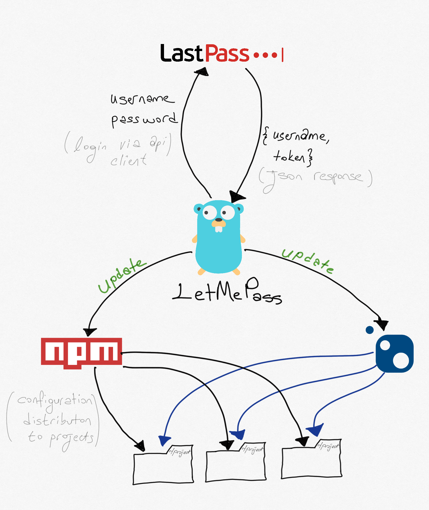

# LetMePass

The pain ehm.. goal behind this project is to have a seamless update mechanism between my local machine, LastPass, and JFrog artifactory.

The application assumes that keys are stored on LastPass, so this small application enables you to have the updates whenever you run it.

Several rules make your life easier with this application, here they are:

## Prerequisites

* NuGet, installed and set to the `PATH`

## Embrace And Love The `targets.yaml` File

There is a file called `targets.yaml,` which defines the necessary interaction between `LetMePass` and your local environment. It stores the source URLs to register to your local and credentials for LastPass.

Inevitably, `targets.yaml` has a syntax that LetMePass uses to ask LastPass about your token, and update them in your local environment to let you develop.

```yaml
username: "user@email.com"
password: "pass"
keyName: "token_key_name_at_the_last_pass"
resources:
  nuget:
    sources:
      - "https://your_source_url/api/nuget/dev-nuget-ci"
      - "https://your_source_url/source/api/nuget/dev-nuget-release"
  npm:
    registryName: "@company"
    sources:
      - "https://your_source_url/api/npm/dev-npm-release"
    projects:
      - /Users/osoykan/Projects/company/project/src/webapps
```

* **username** LastPass user name
* **password** LastPass password
* **keyName** Group/Key identifier that holds the information of your token, be sure that information it holds is `JSON` format.
* **resources** is the main asset that is responsible for configuring your local environment. For now, it only handles `NuGet` and `npm` repositories.
  * Define your source URLs like above, it can be multiple, that means you will have numerous resources.
  * Names are auto-generated, for example, `Nuget_0`, `Nuget_1` as long as it continues...
  * **projects** is a place for syncing your `.NuGet.Config` and `.npmrc` file with your local projects. For instance, you will have an `.npmrc` file that needs to be copied under a project that you have, since `npm install` usually happens locally. So, in other means, configuration files are distributed to your project paths if you want. Otherwise, keep the `YAML` array empty.
  * **registryName** is for scoped npm repositories, usually starts with your company name. For more info please check the [link](https://docs.npmjs.com/about-scopes)

Here is the more visual explanation with my exceptional drawing skills



## Recommendations

You can create Windows service or Linux/OsX service from it, then when you start the PC, it updates the environment, voila!

## Notes

This is something that I've created for myself and been using (yes, works on my machine!) for a while. I just wanted the post the code here. I might be doing some changes every now and then according to my needs.

Feel free to send PRs and feedback.

**Use at your own risk.**
